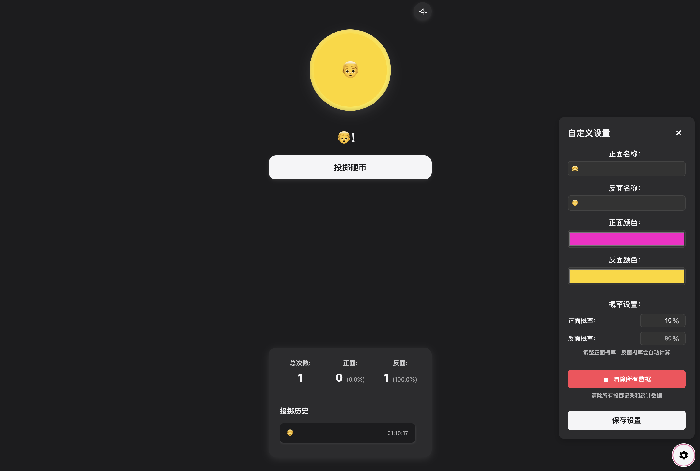

# CoinToss 硬币投掷器

一个优雅的在线硬币投掷工具，具有流畅的动画效果和清脆的音效。

## 特点

- 支持键盘操作（空格键投掷）
- 用户自定义设置



## 文件结构

```bash
├── README.md
├── index.html
├── assets/
│   ├── css/
│   │   └── styles.css
│   ├── js/
│   │   └── script.js
│   ├── sounds/
│   │   └── coin_toss.mp3
│   └── images/
│       ├── coin-heads.svg
│       ├── coin-tails.svg
│       └── coin-edge.svg
```

## 使用方法

直接双击 `index.html` 即可在浏览器中运行。
点击硬币或按空格键即可投掷。